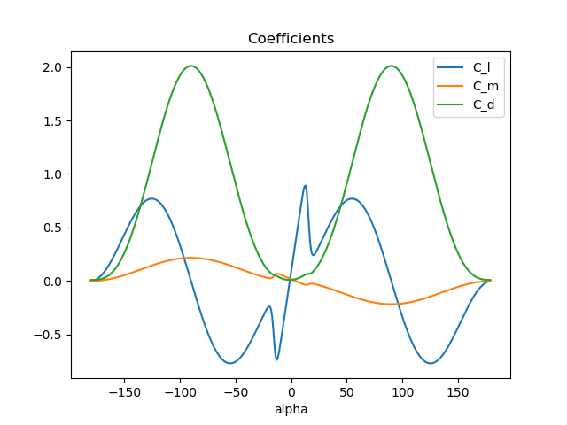
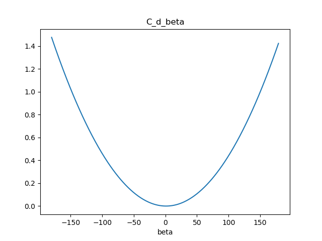
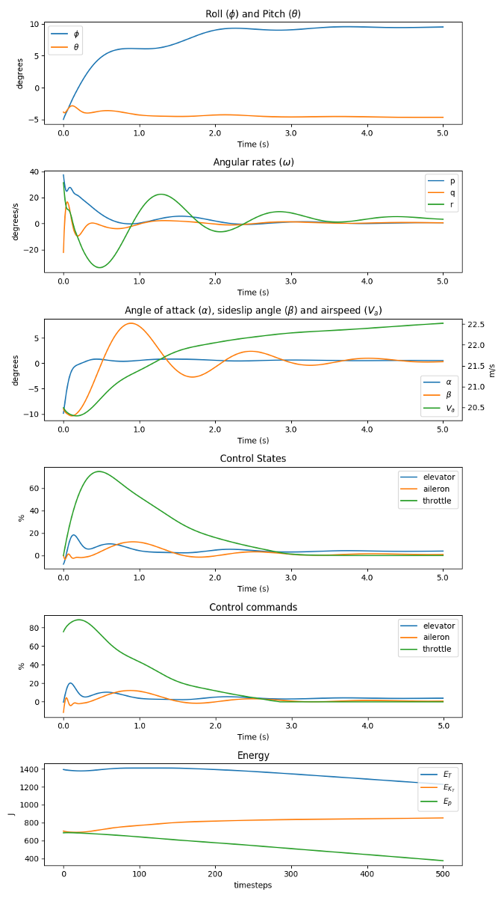

# PyFly - Python Fixed Wing Flight Simulator
PyFly is a python implementation of a 6 DOF aerodynamic model for fixed wing aircraft. The base aircraft parameters must be specified through a parameter file, an example of such a file that is experimentally verified
by wind tunnel testing is included for the Skywalker X8 UAV, courtesy of <https://github.com/krisgry/x8>. PyFly uses
quaternions internally for performance reasons and to avoid singularities, while constraints and initial conditions can be
specified in euler angles for convenience. PyFly also simulates the effects of wind and stochastic turbulence, 
modeled with the Dryden turbulence model. A simple PID-controller tuned to the Skywalker X8 UAV is included for convenience
 and sanity checks. The [gym environment wrapper](https://github.com/eivindeb/fixed-wing-gym) further extends the functionality of the 
 PyFly simulator and allows for integration with reinforcement learning libraries.

Aerodynamic coefficients in PyFly contain nonlinear extensions in angle of attack and sideslip angle, designed with 
Newtonian flat-plate-theory, in an effort to extend model-validity in the state space and incorporate effects such as stall:



## Example

```python
from pyfly import PyFly
from pid_controller import PIDController

sim = PyFly("pyfly_config.json", "x8_param.mat")
sim.seed(0)

sim.reset(state={"roll": -0.5, "pitch": 0.15})

pid = PIDController(sim.dt)
pid.set_reference(phi=0.2, theta=0, va=22)

for step_i in range(500):
    phi = sim.state["roll"].value
    theta = sim.state["pitch"].value
    Va = sim.state["Va"].value
    omega = [sim.state["omega_p"].value, sim.state["omega_q"].value, sim.state["omega_r"].value]

    action = pid.get_action(phi, theta, Va, omega)
    success, step_info = sim.step(action)

    if not success:
        break

sim.render(block=True)
```

Rendering this scenario produces:



## Installation
PyFly is available through PyPI at pyfly-fixed-wing:
```shell
pip install pyfly-fixed-wing
```
Or, it can be installed from source:
```shell
git clone https://github.com/eivindeb/pyfly
cd pyfly
pip install -e .
```

## Documentation
PyFly is highly configurable through its config json file. For a description of functions and their use, see the 
docstrings of each function. 
 
The config file consists of four blocks:

### System settings
The system settings consists of the following arguments, of which all are required:

* **dt**: Float. The integration duration for each call to step()
* **g**: Float. The gravitational acceleration
* **rho**: Float. The permutativity of the air
* **turbulence** Boolean. Controls if turbulence (from Dryden Turbulence Model) is enabled.
* **turbulence_intensity** String. If turbulence is enabled, controls the intensity of the turbulence as described in the Dryden
Turbulence Model. One of "light", "moderate", "severe".
* **turbulunce_sim_length** Int. How many steps that are simulated for each call to the Dryden Turbulence Model. 
Higher values gives more upfront computation cost but better overall performance for longer simulations.

### States
All states used in the simulator must be declared in the states block. The simulator wont run without the states in 
PyFly.REQUIRED_VARIABLES being declared, but optional states such as energy states can be declared here if they are to
be plotted or otherwise are needed. Quaternions are used internally to represent attitude, but initial/value/constraint
conditions are given on the Euler angles roll, pitch and yaw.

Only the name argument is strictly required, although other arguments can be
required if the state is to be plotted.

* **name**: String. Name of state
* **unit**: String. The unit the variable is to be plotted in. Can be any arbitrary string or %, for which its values
will be plotted as a percentage of maximum and minimum values as specified by value_max and value_min. States in plots
that share units are drawn on the same axis.
* **init_min**: Float. The minimum value the state can be initialized to.
* **init_max**: Float. The maximum value the state can be initialized to.
* **value_min**: Float. The minimum value the state can assume, e.g. set by physical constraints on state.
* **value_max**: Float. The maximum value the state can assume, e.g. set by physical constraints on state.
* **constraints_min** Float. The state will raise a ConstraintException if it is set lower than this value.
* **constraints_min** Float. The state will raise a ConstraintException if it is set higher than this value.
* **convert_to_radians** Boolean. Set this to true if the configuration arguments for the state are given in degrees.
* **wrap** Boolean. If set to true, the value will be wrapped in [-pi, pi].
* **label** String. The label of the state in plots. Supports Latex syntax.

For states representing actuators, some additional arguments are required:
* **order** Integer. The order of the dynamics of the actuator state. One of 1 or 2.
* **omega_0** Float. The undamped natural frequency of the second order dynamics.
* **zeta** Float. The damping factor of the second order dynamics.
* **tau** Float. The time constant for first order actuator dynamics.
* **dot_max** Float. Saturation on the magnitude of the derivative of the state for second order actuator dynamics.
* **disabled** Boolean. Sets the state to disabled and its value to zero. E.g. if the aircraft in question has no rudder,
and rudder is not virtualized through any other actuators.

### Actuation
The actuation block defines the inputs given to the simulator, and the states used to simulate the actuator dynamics.
Note that these can be different from the actuators used in the model (i.e. elevator, aileron, rudder, throttle), e.g.
if the aircraft in question has elevons instead of elevator and aileron, in which case the actuator states will be 
mapped to the ones required by the simulator model.

* **dynamics** List of strings. The names of the states used to simulate the actuator dynamics of the aircraft. These should be the
actuators physically present on the aircraft.
* **inputs** List of strings. The names of the states for which setpoints are fed to the step() function.

### Plots
Plots can easily be constructed through the plots block. Each entry gets its own plot in the figure produced by render
when mode="plot". A plot can support any number of states, so long as the set of state contains a maximum of two unique units.
States with differing unit from the first listed state will be plotted on a twin y-axis on the right side of the figure.
* **title**: String. Title of the plot.
* **x_unit**. String. The unit of the x-axis. One of "seconds" or "timesteps".
* **states**. List of strings. The names of the states to be included in the plot.
* **plot_quantity**. String. Only used for actuator states. What quantity of the state to plot, one of "value", "dot"
or "command".

Additionally, each state can be plotted by itself by calling its plot function. 

## Citation
If you use this software, please cite:

```text
@inproceedings{bohn2019deep,
  title={Deep Reinforcement Learning Attitude Control of Fixed-Wing UAVs Using Proximal Policy optimization},
  author={B{\o}hn, Eivind and Coates, Erlend M and Moe, Signe and Johansen, Tor Arne},
  booktitle={2019 International Conference on Unmanned Aircraft Systems (ICUAS)},
  pages={523--533},
  year={2019},
  organization={IEEE}
}
```

## Changelog

### Release 0.1.2 (2020-04-23)

---

* Reworked Dryden Turbulence Model.
    * Refactored code, adding docstrings to functions.
    * Changed method for specifying white noise input to shaping filter to allow for deterministic outputs.
    * Fix bug where filters were simulated for more steps than intended.
    * Fix bug where wrong white noise input were provided to the omega_q and omega_r shaping filters.
    * Added parameter for turbulence simulation length in configuration file.

* Updated README.

* PyFly is now available on PyPI under the name [pyfly-fixed-wing](https://pypi.org/project/pyfly-fixed-wing/).

### Release 0.1.1 (2019-08-20)

---

* Reworked actuation module
    * Added actuation block to config file, specifying the input states to the step function and the states used
to simulate the actuator dynamics. 
    * PyFly now supports directly inputing elevon commands

* Added optional energy states. When present in the states block of the config file, PyFly will calculate and record
the specified energy states, allowing them to be inspected and plotted.

* Target bounds can now be specified for variable plot. When the state value is within the bound of the target value,
the bound area will be shaded with the lines' color.

* Updated README and example.


